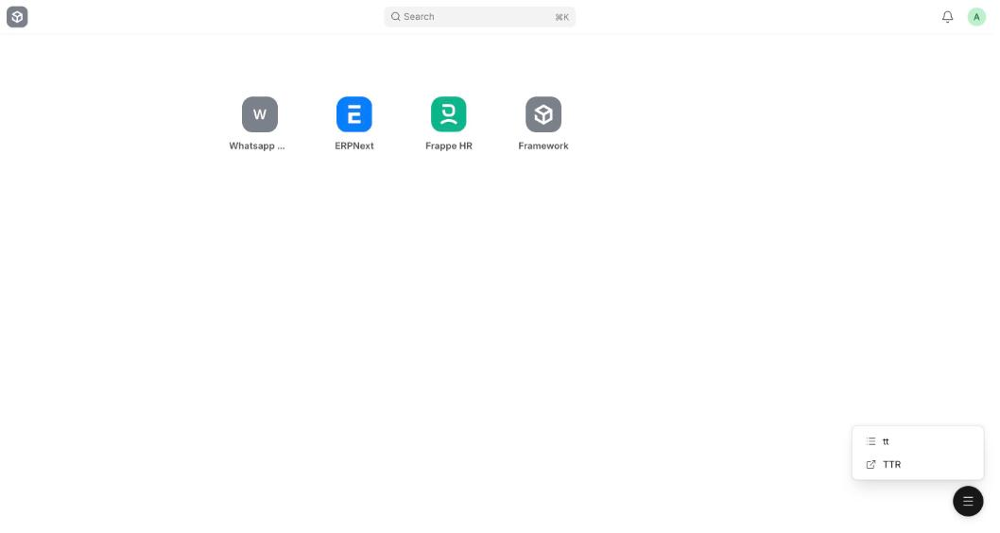
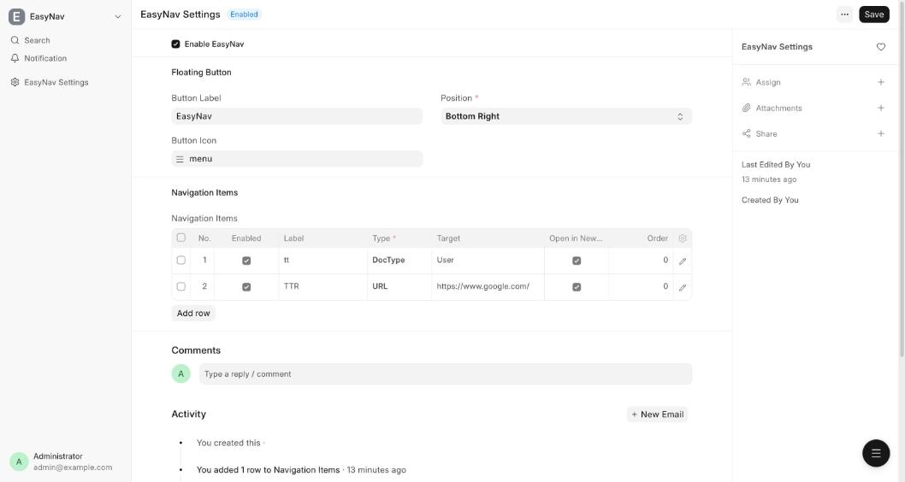

# EasyNav

EasyNav is a custom Frappe app that adds one **global floating navigation button** to every Desk page. Administrators configure the menu in a Setup DocType, so no code changes are needed to change the navigation.



- Quick access to **DocTypes, Pages, Reports and external URLs**
- Configured in **EasyNav Settings** (enable/disable, position, items, order, open in new tab)
- **Respects Frappe permissions**: users only see items they are allowed to open
- Tiny footprint: no extra request on page load, about 3 KB (gzipped) of JS

Tested against Frappe `17.0.0-dev`.

## Installation

```bash
cd $PATH_TO_YOUR_BENCH
bench get-app $URL_OF_THIS_REPO --branch develop
bench --site <site-name> install-app easynav
bench build --app easynav
bench --site <site-name> migrate
bench restart
```

After a code update, hard-reload the browser (Cmd/Ctrl+Shift+R): Desk caches `easynav.js` and `easynav.css`.

## Configuration

Open **EasyNav Settings** (`/desk/easynav-settings`, System Manager only).



| Field | Purpose |
|---|---|
| Enable EasyNav | Turns the button on or off for everyone |
| Button Label | Tooltip / accessible name of the button |
| Button Icon | Icon of the floating button (defaults to `menu`) |
| Position | Bottom Right (default), Bottom Left, Top Right, Top Left |
| Navigation Items | The menu entries (below) |

### Navigation items

| Field | Notes |
|---|---|
| Enabled | Disabled rows are never shown and are not validated, so you can keep drafts |
| Label | Text shown in the menu |
| Icon | Optional icon name (letters, digits, `_`, `-`). Falls back to a default per type |
| Type | `DocType`, `Page`, `Report` or `URL` |
| Target | DocType name, Page name, Report name, or URL |
| Open in New Tab | Opens in a new browser tab |
| Order | Lower first. Items with no order follow in row order |

Settings are validated on save:

- Enabled rows need a label and a target.
- DocType, Page and Report targets must exist. Child-table DocTypes are rejected.
- URLs must be `http(s)://...` or a path starting with a single `/`.
- Icon names must be a plain name; Order cannot be negative.

## How it works

```text
EasyNav Settings --> build_navigation(user) --> frappe.boot.easynav --> easynav.js --> floating UI
                       (filter + resolve)       (no extra request)
```

| Piece | Location |
|---|---|
| Settings (Single) and Item (child table) | `easynav/easynav/doctype/easynav_settings`, `easynav_item` |
| Validation (shared by save and API) | `easynav/easynav/validation.py` |
| API `easynav.api.navigation.get_navigation` | `easynav/api/navigation.py` |
| Boot hook (`extend_bootinfo`) | `easynav/boot.py` |
| Global assets (`app_include_js/css`) | `easynav/public/js/easynav.js`, `easynav/public/css/easynav.css` |

### API

`easynav.api.navigation.get_navigation` (logged-in users only) returns:

```json
{
  "enabled": true,
  "position": "bottom-right",
  "button": {"label": "EasyNav", "icon": "menu"},
  "items": [
    {"label": "Users", "icon": null, "type": "DocType", "target": "User",
     "route": ["List", "User"], "path": "/app/user", "open_in_new_tab": false},
    {"label": "Site", "type": "URL", "target": "https://example.com",
     "url": "https://example.com", "open_in_new_tab": true}
  ]
}
```

Routes are resolved on the server:

| Type | `route` |
|---|---|
| DocType | `["List", doctype]`, or `["Form", doctype]` for Single DocTypes |
| Page | `[page]` |
| Report | `["query-report", name]`, or `["List", ref_doctype, "Report", name]` for Report Builder reports |
| URL | no route; `url` is used |

The same payload is placed in `frappe.boot.easynav` on page load. The browser only calls the API again (`easynav.refresh()`) after EasyNav Settings is saved.

### Frontend

- One root element, `#easynav-root`, mounted on `body` once and never duplicated.
- **Click** opens and pins the menu; a second click, an outside click, `Esc` or a Desk route change closes it. **Hover** also opens it on mouse devices.
- Keyboard: `ArrowUp`/`ArrowDown` move through items, `Esc` closes and returns focus to the button.
- Navigation is handled per type: Desk routes use `frappe.set_route`; URLs are re-validated in the browser. `javascript:`, `data:` and similar schemes are blocked. Labels are rendered as text, never HTML.
- Sits below Bootstrap modals (z-index 1030) and is hidden when printing.
- Responsive: compact button on tablets, safe-area aware and larger touch targets on phones.

## Security

- EasyNav is not a permission system. The API only returns items the current user can open (DocType read permission, Page roles, Report roles plus report permission on its DocType) and Frappe still enforces access at the destination.
- EasyNav Settings is readable by System Manager only. The API reads it internally and returns just the filtered menu.
- The API is not available to Guest.
- URLs are validated on save, in the API and in the browser.
- See `easynav/specs/EasyNav_Security_Test_Report.md`.

## Development and testing

```bash
bench --site <site-name> set-config allow_tests true   # once
bench --site <site-name> run-tests --app easynav
```

The suite (`IntegrationTestCase`) covers settings validation, the API (ordering, routes, filtering, invalid data) and permissions for restricted, sales and system-manager users.

After changing JS/CSS run `bench build --app easynav` and hard-reload the browser.

Specifications live in `easynav/specs/`.

## Roadmap

Not in the MVP: role-based and user-specific navigation, groups and nested menus, search, favorites, recent pages, keyboard shortcuts, drag-and-drop builder.

## Contributing

This app uses `pre-commit` for code formatting and linting. Please [install pre-commit](https://pre-commit.com/#installation) and enable it for this repository:

```bash
cd apps/easynav
pre-commit install
```

Pre-commit is configured to use the following tools for checking and formatting your code:

- ruff
- eslint
- prettier
- pyupgrade
## CI

This app can use GitHub Actions for CI. The following workflows are configured:

- CI: Installs this app and runs unit tests on every push to `develop` branch.
- Linters: Runs [Frappe Semgrep Rules](https://github.com/frappe/semgrep-rules) and [pip-audit](https://pypi.org/project/pip-audit/) on every pull request.


## License

mit
